# SeaTrades Domain

Keats Camp seatrade scheduling optimization.

## Core Entities

### Camper

A child attending camp. Has:

- **Name** - Unique identifier
- **Cabin** - Group of ~12 campers staying together
- **Age** - Camp year (determines cabin assignment)
- **Gender** - Used for fleet balance constraints
- **Preferences** - Ranked list of 4 seatrades (required)

### Cabin

A group of campers staying together. Properties:

- **Name** - e.g., "Spindrift", "Tillikum"
- **Gender** - All-boys, all-girls, or mixed (rare)
- **Fleet assignment** - Which fleet (1 or 2) the cabin attends together

### Seatrade

An activity offered at camp. Properties:

- **Name** - e.g., "Sailing", "Kayaking", "Rowing"
- **Capacity** - Min/max campers per session
- **Blocks available** - Which time blocks it's offered in (by default, all 4).

### Block

A time slot within a fleet. There are 4 blocks per day:

- `1a` - Fleet 1, first session
- `1b` - Fleet 1, second session
- `2a` - Fleet 2, first session
- `2b` - Fleet 2, second session

### Fleet

A group of 2 blocks (morning or afternoon):

- **Fleet 1** - Blocks 1a + 1b
- **Fleet 2** - Blocks 2a + 2b

Each cabin is assigned to one fleet for the week.

### Assignment

A mapping of a camper to a seatrade in a specific block. Each camper gets exactly 2 assignments per week (one per block).

### Assignment Export

The app exports assignments in 3 formats for different audiences:

| Format | Sort Order | Use Case |
|--------|------------|----------|
| Captain's Book | Camper (upload order) | Internal logistics and bookkeeping |
| Cabin Leaders | Cabin → Block → Camper | Distribute to cabin leaders for their campers |
| Seatrade Leaders | Block → Seatrade → Cabin → Camper | Day-of attendance at each seatrade session |

Each export includes columns: camper, seatrade, assignment (0/1), preference (1-4), cabin, block.

## Data Flow

```mermaid
flowchart LR
    subgraph User_Input [User Input Layer]
        UI[Streamlit UI]
    end
    
    subgraph State_Layer [Session State]
        direction TB
        S1[seatrade_simulation_config]
        S2[camper_simulation_config]
        S3[optimization_config]
    end
    
    subgraph Solver_Layer [Optimization Engine]
        SA[Seatrades.assign]
        PULP[PuLP Solver]
    end
    
    subgraph Output_Layer [Output]
        DF[(Assignments DataFrame)]
        Display[Assignments Tab Display]
    end
    
    UI --> State_Layer
    State_Layer -->|preferences| SA
    SA -->|MILP Problem| PULP
    PULP -->|solution| DF
    DF --> Display
    
    classDef userInput fill:#e1f5fe,stroke:#0277bd,stroke-width:2px,shape:sloped-rectangle;
    classDef state fill:#fff3e0,stroke:#ef6c00,stroke-width:2px,shape:cylinder;
    classDef process fill:#e8f5e9,stroke:#2e7d32,stroke-width:2px;
    classDef solver fill:#f3e5f5,stroke:#7b1fa2,stroke-width:2px,shape:subprocess;
    classDef output fill:#fce4ec,stroke:#c2185b,stroke-width:2px,shape:display;
    
    class UI userInput;
    class S1,S2,S3 state;
    class SA process;
    class PULP solver;
    class DF,Display output;
```

## Optimization Problem

The scheduler solves a mixed-integer linear programming problem with these constraints:

1. **One seatrade per block** - Each camper assigned to exactly 1 seatrade in each block
2. **No duplicates** - Camper cannot take same seatrade in both blocks
3. **Capacity limits** - Seatrade capacity enforced (min/max per session)
4. **Preference only** - Campers only assigned seatrades they ranked
5. **Top-2 guarantee** - Campers guaranteed one of their top 2 choices
6. **Cabin max per seatrade** - Max k campers from same cabin in one seatrade (by default k=4)
7. **Fleet balance** - Cabins split evenly between fleets
8. **Gender balance** - Boys/girls cabins split evenly between fleets

## Tech Stack

- **UI:** Streamlit
- **Optimizer:** PuLP (mixed-integer linear programming)
- **Validation:** Pandera (DataFrame schemas)
- **Deployment:** Streamlit Cloud
