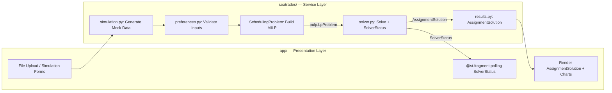

# SeaTrades Domain

Keats Camp seatrade scheduling optimization.

## Core Entities

### Camper

A child attending camp. Has:

- **Name** - Unique identifier
- **Cabin** - Group of ~12 campers staying together
- **Age** - Camp year (determines cabin assignment)
- **Gender** - Used for fleet balance constraints
- **Preferences** - Ranked list of 4 seatrades (required)

### Cabin

A group of campers staying together. Properties:

- **Name** - e.g., "Spindrift", "Tillikum"
- **Gender** - All-boys, all-girls, or mixed (rare)
- **Fleet assignment** - Which fleet (1 or 2) the cabin attends together

### Seatrade

An activity offered at camp. Properties:

- **Name** - e.g., "Sailing", "Kayaking", "Rowing"
- **Capacity** - Min/max campers per session
- **Blocks available** - Which time blocks it's offered in (by default, all 4).

### Block

A time slot within a fleet. There are 4 blocks per day:

- `1a` - Fleet 1, first session
- `1b` - Fleet 1, second session
- `2a` - Fleet 2, first session
- `2b` - Fleet 2, second session

### Fleet

A group of 2 blocks (morning or afternoon):

- **Fleet 1** - Blocks 1a + 1b
- **Fleet 2** - Blocks 2a + 2b

Each cabin is assigned to one fleet for the week.

### Assignment

A mapping of a camper to a seatrade in a specific block. Each camper gets exactly 2 assignments per week (one per block).

### AssignmentSolution

The resolved output of solving a seatrade scheduling problem. Produced by wrangling the solver's raw binary decision variables into a long-form DataFrame with columns: camper, seatrade, block, preference, cabin, assignment. Owned by the core package, not the problem builder or the UI.

### SolverStatus

Tracks the state of an in-progress or completed solve. Fields: percent, message, state (running/complete/error). Owned by the service layer, read by the UI via `@st.fragment` polling. Currently reports infeasibility as a message only; future work to add structured constraint-conflict diagnostics.

### Assignment Export

The app exports assignments in 3 formats for different audiences:

| Format | Sort Order | Use Case |
|--------|------------|----------|
| Captain's Book | Camper (upload order) | Internal logistics and bookkeeping |
| Cabin Leaders | Cabin → Block → Camper | Distribute to cabin leaders for their campers |
| Seatrade Leaders | Block → Seatrade → Cabin → Camper | Day-of attendance at each seatrade session |

Each export includes columns: camper, seatrade, assignment (0/1), preference (1-4), cabin, block.

## Data Flow



### Pipeline (happy path)

```
1. User uploads CSVs or uses simulation → app/ calls seatrades.simulation
2. Input DataFrames validated → seatrades.preferences (Pandera + cross-ref)
3. SchedulingProblem(prefs, config) → holds parsed state
4. problem.build() → pulp.LpProblem
5. solver.run(problem, config) → AssignmentSolution + SolverStatus
6. UI reads SolverStatus via @st.fragment, displays AssignmentSolution
7. AssignmentSolution.export(view="camper"|"cabin"|"seatrade") → formatted DataFrame
```

## Optimization Problem

The scheduler solves a mixed-integer linear programming problem with these constraints:

1. **One seatrade per block** - Each camper assigned to exactly 1 seatrade in each block
2. **No duplicates** - Camper cannot take same seatrade in both blocks
3. **Capacity limits** - Seatrade capacity enforced (min/max per session)
4. **Preference only** - Campers only assigned seatrades they ranked
5. **Top-2 guarantee** - Campers guaranteed one of their top 2 choices
6. **Cabin max per seatrade** - Max k campers from same cabin in one seatrade (by default k=4)
7. **Fleet balance** - Cabins split evenly between fleets
8. **Gender balance** - Boys/girls cabins split evenly between fleets

## Module Boundaries

| Package | Responsibility |
|---------|---------------|
| `seatrades/` | Service layer — domain logic, optimization, simulation, results |
| `app/` | Presentation layer — Streamlit UI only, no business logic (rename from `seatrades_app/`) |

### app/ modules

| Module | Owns |
|--------|------|
| `app.py` | Entry point, tab layout |
| `state.py` | Constants for all session state keys (low priority, replace scattered strings) |
| `tabs/` | Thin Streamlit presentation — widgets, forms, file uploads. Call service functions, display results. |

### seatrades/ modules

| Module | Owns |
|--------|------|
| `scheduling_problem.py` | `SchedulingProblem` — holds parsed domain state, builds MILP (variables, constraints, objective). Does NOT solve. |
| `solver.py` | Orchestrate solve, track progress (`SolverStatus`), background thread |
| `results.py` | `AssignmentSolution` — wrangle + export views |
| `visualization.py` | Build `alt.Chart` specs from `AssignmentSolution`. No Streamlit dependency — renders in any Altair-capable frontend. |
| `preferences.py` | Pandera schemas + cross-reference validation (e.g., camper prefs must name seatrades that exist) |
| `simulation.py` | Generate mock camper + seatrade data |
| `config.py` | `OptimizationConfig`, `CamperSimulationConfig`, `SeatradeSimulationConfig` |

## Architecture Grilling — Decisions Log

Resolved during grilling session 2026-05-05. Open questions marked with [OPEN].

1. **`Seatrades` class → split into SchedulingProblem + solver + results.** Problem builder owns variables/constraints/objective. Solving is separate. Wrangling is separate. `SchedulingProblem` is stateful (holds parsed domain state) because the wrangler needs the same state — avoids re-parsing or building a second context object.

2. **Solver produces `AssignmentSolution`, not raw pulp object.** Clean boundary: problem goes in, solution comes out. No leaking PuLP internals.

3. **Service function `solver.run(problem, config) -> AssignmentSolution + SolverStatus`.** UI calls one function. No solver orchestration in the presentation layer.

4. **Solver monitoring splits: service layer runs solver + reads CBC log, UI polls `SolverStatus` via `@st.fragment`.** PuLP/CBC doesn't support mid-solve callbacks — log file is the only progress signal. `@st.fragment(run_every=...)` replaces manual `while`+`sleep` polling.

5. **Simulation data generation moves to service layer** (`seatrades/simulation.py`). It's domain logic, not UI.

6. **Cross-reference validation moves to service layer** (`seatrades/preferences.py`). Dynamic Pandera subclass generation for checking camper prefs against available seatrades becomes a function that takes `available_seatrades` as a parameter.

7. **Config dataclasses move to service layer** (`seatrades/config.py`). `OptimizationConfig`, `CamperSimulationConfig`, `SeatradeSimulationConfig` don't belong in UI files.

8. **Infeasibility: report only for now (A), diagnose later (B).** `SolverStatus` reports error state + message. Structured constraint-conflict diagnostics are future work.

9. **Session state keys: centralize in `app/state.py`** (low priority). Replaces scattered string literals for IDE support and typo protection.

10. **Rename `seatrades_app/` → `app/`**. Follows Streamlit convention, avoids naming confusion with `seatrades/` service package.

11. **Altair chart → separate `seatrades/visualization.py` module.** Chart is neither presentation layer nor data model — it's a visualization spec that consumes `AssignmentSolution`. Stays in service layer (no Streamlit dep) so it's reusable outside the app (API, notebooks, other frontends). `results.py` stays clean: data model + export only. `app/` renders via `st.altair_chart()`.

## Tech Stack

- **UI:** Streamlit
- **Optimizer:** PuLP (mixed-integer linear programming)
- **Validation:** Pandera (DataFrame schemas)
- **Deployment:** Streamlit Cloud

## Git Workflow

Three branch prefixes: `feature/` (PRD or standalone feature), `dev/` (issue within a PRD), `fix/` (bug fix off main). All merges are squash-merge via PR. PRD branches are long-lived staging areas for QA. See [ADR 0005](docs/adr/0005-git-branching-strategy.md).